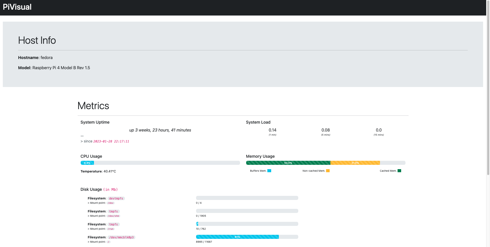

# :telescope: `PiVisual`

```bash
   ___ _         _                 _
  / _ (_) /\   /(_)___ _   _  __ _| |
 / /_)/ | \ \ / / / __| | | |/ _` | |
/ ___/| |  \ V /| \__ \ |_| | (_| | |
\/    |_|   \_/ |_|___/\__,_|\__,_|_|
```

[](https://github.com/meobilivang/PiVisual/blob/master/LICENSE)

> A homemade metrics dashboard for `Rasberry Pi`.



# :wrench: Set up

> The following steps are specified for `Fedora`

## Prepare directory

- Clone repo

```bash
$ git clone https://github.com/meobilivang/PiVisual.git
```

- Install `virtualenv`

```bash
$ python3 -m venv .venv
```

- Start `virtualenv` & install dependencies

```bash
$ source .venv/bin/activate
$ pip install -r requirements.txt
```

## Set up `supervisor`

> `supervisor`? *manage and monitor processes on UNIX environment*.

- Install `supervisor`

```bash
$ sudo dnf install supervisor
```

- Start `supervisor` & Enable on startup

```bash
$ systemctl enable supervisord && systemctl restart supervisord
```

- Configure `PiVisual` process

```bash
$ ln -s /home/pnguyen/PiVisual/deploy/supervisor/pi-visual.ini /etc/supervisor/conf.d/pi-visual.conf
```

```ini
[program:pi-visual]
# refer to: http://supervisord.org/configuration.html#program-x-section-settings
user=pnguyen
directory=/home/pnguyen/PiVisual                          ; set to your own path
command=/home/pnguyen/PiVisual/.venv/bin/gunicorn app:app -c /home/pnguyen/PiVisual/gunicorn.py       ; set to your own path
autorestart=true
autorestart=true        ; runs on startup
startretries=3
logfile=/dev/null
```

- Reload config

```bash
$ sudo supervisorctl reread
$ sudo supervisorctl update
```

## Set up `nginx`

- (Required) Allow port `80`

```bash
# or $ firewall-cmd --zone=public --add-port=80/tcp --permanent
$ sudo firewall-cmd --zone=public --add-service=http --permanent
$ firewall-cmd --reload
```

- (*If `SELinux` is enabled*) Enable connection to proxied connection `SELinux`

```bash
$ sudo setsebool httpd_can_network_connect 1 -P
```

- Install `nginx`

```bash
$ sudo dnf install nginx
```

- Configure `nginx` to proxy requests to the our `Python` server
> Minimal configurations for personal lab. Not recommeded for real production!
```bash
$ vi /etc/nginx/nginx.conf
----
...
user <user_you_are_using>
...

location / {
    proxy_pass http://localhost:5000/;
    proxy_set_header Host $host
    proxy_set_header X-Forwarded-Proto $scheme
    proxy_set_header X-Forwarded-For $proxy_add_x_forwarded_for;
    proxy_set_header X-Real-IP $remote_addr;
}
```

- Apply latest configuration

```bash
$ systemctl restart nginx
```

## :book: Resources

- Got huge inspiration from Chris's [Pidash](https://github.com/chrisx8/pidash) :pray:

- [Deploy a Python Flask Restful API app with Gunicorn supervisor and nginx](https://thucnc.medium.com/deploy-a-python-flask-restful-api-app-with-gunicorn-supervisor-and-nginx-62b20d62691f)
- [Configuring `nginx` for a flask web application](https://www.patricksoftwareblog.com/how-to-configure-nginx-for-a-flask-web-application/)
- [Configure Webserver for RHEL-like system - GovReady-Q](https://govready-q.readthedocs.io/en/v0.9.1/configure_webserver.html)
